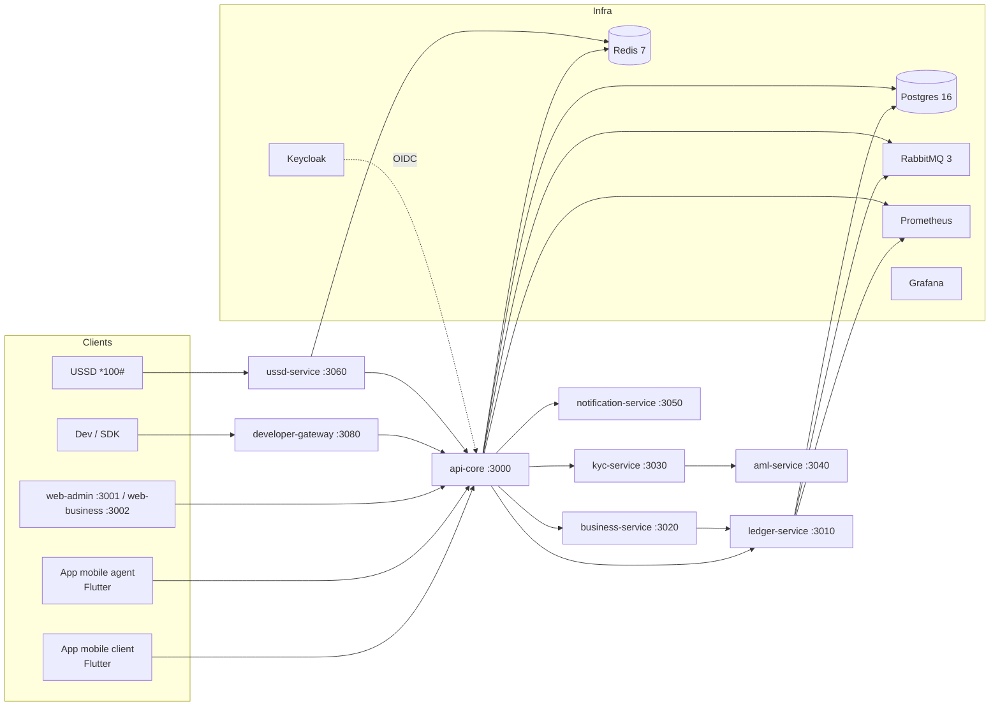

# REVUE-CONSTITUTION.md — Constitution du dépôt CauriPay

> **Source de vérité** de l'architecture cible. Les issues `GOURSI-*` y réfèrent par section.
> Une modification de la constitution passe par une ADR (voir [docs/ADR/](ADR/)).
> Dernière revue : 2026-08-14 (consolidation lead — fusion des versions parallèles).

---

## 1. Vision

CauriPay est une **plateforme de paiement (wallet) dev-first pour l'Afrique centrale et de l'Ouest**
(UEMOA / CEMAC) : mobile money, cartes, paiements internationaux — via une API unique type Stripe,
un SDK, des webhooks fiables et un dashboard complet.

**Le cœur produit est la plateforme wallet** (comptes, soldes, transactions P2P, cash-in/out,
paiements marchands, KYC/AML). L'agrégateur de paiement v0.1 (`apps/api-mvp`) n'est **pas** la cible :
il est conservé en historique comme référence du produit sandbox initial. (ADR-002)

### Principes non négociables

1. **L'argent est une donnée comptable** : toute transaction passe par le ledger (écritures immuables,
   équilibre comptable, optimiste locking). Jamais de mutation de solde hors ledger.
2. **Montants en unités mineures entières** (ou Decimal) — jamais de float.
3. **`main` est sacré** : PR obligatoire, CI verte, linear history.
4. **Conventional Commits** + une issue → une branche → une PR.
5. **Secrets jamais dans le dépôt** (gitleaks 0 finding).
6. **Idempotence partout** où une opération a un effet de bord financier.
7. **Événements par domaine** (`financial.*`, `kyc.*`, `aml.*`, `notification.*`, `audit.*`) via RabbitMQ.
8. **Frontière wallet** : seul `ledger-service` écrit les soldes ; `api-core` crée les wallets (solde 0)
   et lit via le ledger. (ADR-004)

---

## 2. Arborescence cible (§5)

```
cauripay/
├── apps/                    # Applications : fronts, apps mobiles, référence v0.1
│   ├── api-mvp/             #   v0.1 sandbox aggregator (Fastify+SQLite) — HISTORIQUE (amendement §3 écart 6)
│   ├── dashboard/           #   v0.1 dashboard React — HISTORIQUE
│   ├── web-admin/           #   (G4) Next.js + Keycloak OIDC — port 3001
│   └── web-business/        #   (G4) espace marchand Next.js — port 3002
├── services/                # Microservices NestJS (TS) + ledger (Java)
│   ├── ledger-service/      #   Java 21 · Spring Boot 3.2 — port 3010 (cœur comptable)
│   ├── api-core/            #   NestJS — port 3000 (auth, transactions, wallets)
│   ├── business-service/    #   NestJS — port 3020 (marchands, bulk, webhooks)
│   ├── kyc-service/         #   NestJS — port 3030 (KYC)
│   ├── aml-service/         #   NestJS — port 3040 (AML / gel wallets)
│   ├── ussd-service/        #   NestJS — port 3060 (USSD)
│   ├── notification-service/#   NestJS — port 3050 (notifications)
│   ├── reconciliation-service/ # NestJS — port 3070 (rapprochement)
│   └── developer-gateway/   #   NestJS — port 3080 (G5, API keys, rate limiting, SDK)
├── packages/                # Packages TS partagés (zéro dépendance runtime)
│   ├── shared-types/
│   ├── validation-rules/
│   ├── payment-rail-contracts/
│   ├── js-sdk/
│   └── flutter-sdk/
├── infra/                   # Docker, compose, Keycloak, RabbitMQ, Prometheus, Grafana
├── scripts/                 # Outillage (setup-check.sh, audit-sql, seed)
├── tests/                   # load (k6) · security (ZAP)
└── docs/                    # Constitution, design, ADR, API, roadmap, sécurité…
```

**Règle** : un nouveau service NestJS = un workspace npm ajouté sous `services/`
(`npm install` racine suffit). Un service Java = un module Maven sous `services/`.

> **Convention de ports (ADR-004, DESIGN-v2 §2)** : api-core 3000 · web-admin 3001 · web-business 3002 ·
> ledger 3010 · business 3020 · kyc 3030 · aml 3040 · notification 3050 · ussd 3060 · reconciliation 3070 ·
> developer-gateway 3080. Aucun autre port ne doit être utilisé dans les configs ou la doc.

---

## 3. Écarts & décisions de migration

| # | Écart | Décision | Référence |
|---|---|---|---|
| 1 | Le v0.1 (agrégateur) n'est pas la cible produit | **Conservé en historique** ; les issues de son backlog sortent du périmètre actif | ADR-002 |
| 2 | kyc/aml logés dans api-core par l'ancien catalogue | **Services dédiés** (tableau architecture prime) | ADR-001 |
| 3 | Création du wallet | **Créé à l'inscription** (BASIC), dans la même `$transaction` | ADR-003 |
| 4 | Ports ambigus | **Convention de ports** fixée (§2, DESIGN-v2) | ADR-004 |
| 5 | Spec non versionnée dans le dépôt | **Dossier de conception v2 = source de vérité** (docs/DESIGN-v2.md) + matrice de traçabilité | DESIGN-v2, TRACABILITY |
| 6 | DESIGN-v2 §1 prévoyait `legacy/` ; la restructuration a placé le v0.1 dans `apps/` | **`apps/api-mvp` + `apps/dashboard` font office d'historique**, restent buildables et testés en CI (npm workspaces). Toute référence à `legacy/` dans la doc est obsolète | ADR-002 (amendement 2026-08-14, lead) |

---

## 4. Architecture cible (§1.2)



- **Idempotence** : Redis (TTL 24 h) côté ledger ; clés UNIQUE en base partout.
- **Événements** : le ledger publie `financial.transaction.completed` (vérité comptable) ;
  `api-core` publie la version enrichie — déduplication par `transactionId`. (ADR-005)

---

## 5. Stack technique & versions

| Élément | Choix | Notes |
|---|---|---|
| Node.js | **22 LTS** | `.nvmrc` = `22` (le v0.1 exige ≥ 22.5 pour `node:sqlite`) |
| TypeScript | ≥ 5.7, `strict` + `noUncheckedIndexedAccess` | `tsconfig.base.json` racine, `paths` vers `packages/*` |
| API services | **NestJS 10** | ConfigModule, PrismaService, Guards JWT Keycloak RS256 |
| Ledger | **Java 21 · Spring Boot 3.2** | Maven, Flyway, JPA + `@Version` |
| Base de données | **PostgreSQL 16** | Schéma ledger **uniquement via Flyway** |
| Cache / idempotence | **Redis 7** | |
| Messages | **RabbitMQ 3** (management) | Topologie idempotente (infra/rabbitmq) |
| Auth | **Keycloak** (realm `goursi`, JWT RS256) | Rôles : §6 |
| Observabilité | Prometheus + Grafana | `/health` + `/metrics` sur chaque service |
| CI | GitHub Actions | lint + tsc + jest + mvn ; gitleaks + trivy |
| Conteneurs | Docker (multi-stage, non-root uid 1000) | `Dockerfile.nestjs`, `Dockerfile.java` |

---

## 6. Rôles & enums métier (§4.4)

**Rôles Keycloak** : `CUSTOMER`, `MERCHANT`, `AGENT`, `DISTRIBUTOR`, `SUPER_ADMIN`,
`COMPLIANCE_OFFICER`, `SUPPORT_L1`, `SUPPORT_L2`, `FINANCE_MANAGER`, `OPS_AGENT_MANAGER`.

**Enums partagés** (`packages/shared-types`) :
- `TransactionStatus` : `PENDING, PROCESSING, SUCCEEDED, FAILED, REVERSED, EXPIRED`
- `TransactionType` : `P2P, CASH_IN, CASH_OUT, BILL_PAYMENT, MERCHANT_PAYMENT`
- `KycLevel` : `BASIC, VERIFIED, PREMIUM`
- `WalletStatus` : `ACTIVE, FROZEN, CLOSED`
- Ledger : `LedgerDirection { DEBIT, CREDIT }`, `EntryType { PRINCIPAL, FEE, COMMISSION, REVERSAL }`

---

## 7. Événements & topologie RabbitMQ (§6)

| Exchange | Type | Routing keys | Queues consommatrices |
|---|---|---|---|
| `financial.events` | topic | `financial.transaction.completed`, `financial.transaction.reversed`, `financial.balance.updated` | `q.reconciliation.financial` (+ DLQ) |
| `kyc.events` | topic | `kyc.submitted`, `kyc.approved`, `kyc.rejected` | `q.aml.created`, `q.kyc.approved` (+ DLQ) |
| `aml.events` | topic | `aml.alert.created`, `aml.wallet.frozen` | `q.audit.insert` (+ DLQ) |
| `notification.events` | fanout | — | `q.notification.all` (+ DLQ) |
| `audit.events` | fanout | — | `q.audit.insert` (+ DLQ) |

Conventions : naming `domaine.entité.action` (ex : `financial.transaction.completed`) ;
jamais de queue auto-nommée pour les consumers métier ; DLQ par queue (`q.<name>.dlq`).

---

## 8. Sécurité & secrets (§3.7)

- **INTERNAL_SERVICE_KEY** : clé partagée inter-services, header `X-Service-Key`,
  comparaison **temps constant** côté Java. Générée par environnement — **aucune valeur par défaut en prod**.
- Rotation documentée dans [docs/SECURITY.md](SECURITY.md).
- Interdiction absolue : secret réel dans le dépôt, même chiffré.
- Règles produit : webhooks signés, anti-SSRF (IP privées interdites en prod),
  clés API hachées au repos (v0.2+), rate limiting par clé.

---

## 9. Observabilité (§3.9)

- Chaque service : `GET /health` (liveness + readiness) et `GET /metrics` (Prometheus).
- NestJS : `@nestjs/terminus` + `prom-client`. Java : Actuator + `micrometer-registry-prometheus`.
- Dashboards Grafana provisionnés : PostgreSQL, RabbitMQ, latence API, erreurs ledger.
- **Aucune métrique de données personnelles** (pas de numéros, montants par client).

---

## 10. Définition de done MVP (§8.5) — preuves exigées

| # | Critère | Preuve |
|---|---|---|
| 1 | Transfert = 4 écritures ledger atomiques | Test intégration ledger (GOURSI-014b) |
| 2 | Concurrence maîtrisée (`@Version`) | Test 10 threads (GOURSI-014f) |
| 3 | Triggers d'immutabilité en base | Migrations Flyway V5–V6 + tests (GOURSI-011d) |
| 4 | Équilibre comptable (SUM = balance) | Scripts d'audit SQL (GOURSI-QA2) |
| 5 | P2P < 10 s | Test E2E api-core (GOURSI-023b) |
| 6 | KYC < 3 min | Test kyc-service (GOURSI-024) |
| 7 | 1000 tx/min (p95 < 2 s, erreur < 0,1 %) | k6 (GOURSI-QA1) |
| 8 | USSD : 4 opérations complètes | Simulateur + tests (GOURSI-027) |
| 9 | gitleaks 0 finding | CI security-scan (GOURSI-005b) |
| 10 | ZAP 0 critique | Rapport ZAP (GOURSI-QA3) |

Suivi dans [docs/DoD.md](DoD.md).

---

## 11. Règles de constitution (binding pour tout contributeur)

1. **Branches** : `feat/GOURSI-XXX-description`, `fix/…`, `docs/…` — jamais de commit direct sur `main`.
2. **Conventional Commits** avec scope : `feat(GOURSI-001): …`.
3. **CI verte obligatoire** avant merge (lint + tsc + jest + mvn test + gitleaks + trivy).
4. **PR** : titre = clé GOURSI, corps = contexte + tests + preuve d'acceptation, `Closes #n`.
5. **1 service = 1 workspace** (NestJS) ; ledger-service hors workspaces npm (Maven).
6. **DoD MVP** : les 10 critères de DESIGN-v2 §8 sont vérifiés par des preuves commitées (tests/rapports).
7. **Toute correction de migration** = nouvelle migration V{n+1}, jamais d'édition des V appliquées.

---

## 12. Milestones & traçabilité

| Milestone | Contenu | Issues |
|---|---|---|
| **G0** | Fondation & infrastructure (monorepo, compose, CI, Keycloak, RabbitMQ, observabilité) | GOURSI-001…005, KC1, RMQ1, OBS1, SEC1 |
| **G1** | ledger-service Java (cœur comptable) | GOURSI-010…016, LED1 |
| **G2** | api-core & services réglementaires (auth, transactions, KYC, AML) | GOURSI-020…025 |
| **G3** | business-service & reconciliation | GOURSI-030…033 |
| **G4** | Fronts & mobile (web-admin, web-business, mobile) | GOURSI-040…043 |
| **G5** | Developer platform (SDK, developer-gateway) | GOURSI-050…051 |
| **G6** | QA, sécurité & DoD | GOURSI-QA1…QA7, SEC1 |

Matrice complète spec ↔ issues : [docs/TRACABILITY.md](TRACABILITY.md).

---

*Constitution maintenue par le lead du projet. Toute évolution → nouvelle ADR.*
